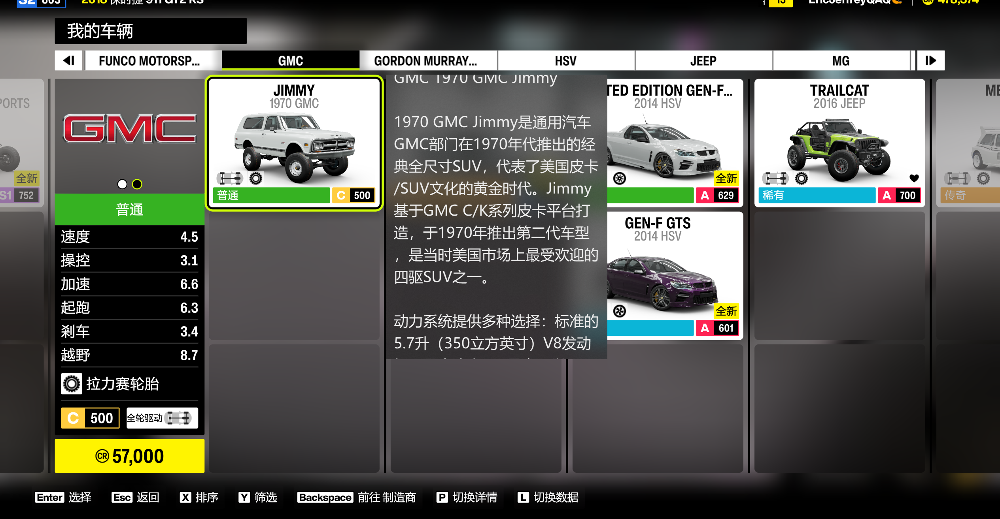

[中文版](README.md).

# FH6 AutoInfo

**In-game vehicle info overlay for Forza Horizon 6.** Press a button, get car details instantly — no Alt+Tab needed.



[Demo Video](resources/demo.mp4)

## Features

- **One-button trigger** — Xbox controller or keyboard, works without leaving the game
- **Auto detection** — Snaps a screenshot, finds the highlighted car card by its yellow border, and reads the name via OCR
- **AI+Smart lookup** — Matches against a local database first (exact / keyword / fuzzy), falls back to LLM API if nothing matches

## Tech Stack

| Tech | What it does |
|------|-------------|
| Python 3 | Core logic |
| PyQt5 | Overlay window |
| PaddleOCR PP-OCRv5 | Detect car names from screenshots |
| OpenCV + PIL | Image processing & selection detection |
| win32gui / win32api | Fullscreen capture on Windows |
| pygame | Controller input |
| rapidfuzz | Fuzzy string matching |

## Installation

### 1. Download Project Files
```bash
git clone https://github.com/EricJeffrey/CarHelper4Horizon6.git
cd CarHelper4Horizon6
pip install -r src/requirements.txt
```

### 2. Install PaddleOCR Models

Text recognition uses the **PP-OCRv5_mobile** model. You can download it from https://www.paddleocr.ai/main/version3.x/pipeline_usage/OCR.html, place files in the `models/` folder, then update `det_model_dir` / `rec_model_dir` in `src/config.json`. Expected folder structure:

```
PP-OCRv5_mobile_det_infer:
- inference.json
- inference.pdiparams
- inference.yml

PP-OCRv5_mobile_rec_infer:
- inference.json
- inference.pdiparams
- inference.yml
```

### 3. Car Database

The local database is located at `resources/cars_info.jsonl` (one JSON object per line). It was batch-generated by an LLM so some entries may be inaccurate — feel free to edit.

You can add your own car info like this:

```json
{"m": "BMW", "m_cn": "宝马", "c": "M3 Competition", "i": "The BMW M3 Competition is a high-performance sports sedan..."}
```
You can also use your own LLM API by modifying the `config.json` file. See [Tweaking Settings](#Tweaking-settings) for details.

## How to Use

### Starting the Tool

> Note: connect your Xbox controller (if you use it to play) before launching the tool.

```bash
cd src
python controller.py
```

Run this before or during your FH6 session — it sits in the background waiting for input.

### Triggering In-Game

1. On the game's car list screen where cars appear as cards, select a car so it gets a **yellow highlight border**
2. Hit **Right Stick** on your controller (or press **`i`** on keyboard) and wait for the car info overlay window to pop up
3. Hit again to close the overlay window

### Tweaking Settings

You can tweak the settings in `src/config.json`:
- **api** — LLM API settings
- **capture** — Screenshot & car detection parameters
- **input** — Keyboard and controller shortcut settings
- **ocr** — PaddleOCR model settings for text recognition
- **match** — Local database matching parameters
- **debug** — Enable debug output or not
- **overlay** — Overlay window size, opacity, and appearance

## Project Layout

```
automaker-helper/
├── src/
│   ├── controller.py       # Main orchestrator
│   ├── input_module.py     # Xbox controller + keyboard listener
│   ├── capture_module.py   # Screenshot & yellow-border card finder
│   ├── ocr_module.py       # PaddleOCR text recognition
│   ├── match_module.py     # Local DB matching
│   ├── api_module.py       # LLM API client (optional fallback)
│   ├── overlay_module.py   # Overlay window
│   ├── gui_bridge.py       # Qt signal bridge
│   ├── utils.py            # Logging helper
│   ├── config.json         # All configuration
│   └── requirements.txt    # Python dependencies
├── resources/
│   └── cars_info.jsonl     # Car database (JSONL)
└── models/                 # Offline OCR models
```

## How It Works

1. **Capture** — Fullscreen screenshot → detect yellow-highlighted card via color contour analysis → crop the name area
2. **OCR** — Feed the crop through PaddleOCR to extract the car name string
3. **Match** — Query local `cars_info.jsonl`. If no match found and API is enabled, call the configured LLM API as fallback
4. **Display** — Render the result in a borderless, always-on-top overlay with Windows Acrylic blur
